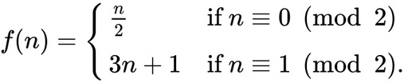

# Code Challenge: Collatz Sequence

So what is the Collatz Sequence?  The short answer is, it's a sequence of numbers generated following a mathematical formula that when starting with any positive integer always ends with 1.  

> The Collatz Conjecture is one of the most famous unsolved problems in mathematics. The conjecture asks whether repeating two simple arithmetic operations will eventually transform every positive integer into 1. It concerns sequences of integers in which each term is obtained from the previous term as follows: if the previous term is even, the next term is one half of the previous term. If the previous term is odd, the next term is 3 times the previous term plus 1. The conjecture is that these sequences always reach 1, no matter which positive integer is chosen to start the sequence. [(Wikipedia contributors, 2022)](#references)

## How to Start the Challenge

1. Fork this project to your account ([Forking a repository](https://docs.github.com/en/get-started/quickstart/fork-a-repo#forking-a-repository))
1. Clone the forked repo to your computer ([Cloning a repository](https://docs.github.com/en/repositories/creating-and-managing-repositories/cloning-a-repository#cloning-a-repository))
1. Start a new project, in a language of your choosing, in the cloned repo
1. Complete the requirements listed in [Requirements](#requirements)
1. Validate your program against the values in [Validation](#validation)

## Join in on the discussion in our [Discord code-challenge](https://discord.com/channels/966813541569003581/1004198114917371964) channel!
- Share your solution
- Ask questions
- Check out the solutions others have come up with
- Provide feedback on the code challenge itself

## Requirements

Write a console program that meets the following requirements:

- Get user input for any positive integer
  - Ensure that the user enters valid input
- Generate the Collatz Sequence
  - If the number is even, divide the number by 2 to get the next number
  - If the number is odd, multiply the number by 3 and add 1 to get the next number
- Continue until you reach the final number of the sequence, 1
- Display the sequence
- Prompt for a new starting number and generate sequence until the user decides to quit

## Validation

Enter the below values to get the Collatz Sequence.  Compare the length of your generated sequence to the length listed with the value below.  If they are the same then your sequence is correct.

| Input Value | Sequence Length |
| --- | --- |
| 5 | 5 |
| 50 | 18 |
| 5000 | 23 |
| 5000000 | 98 |
| 5000000000 | 89 |
| 5000000000000000000000000000000000000 | 448 |

 

***

#### References

Wikipedia contributors. (2022, June 30). Collatz conjecture. Wikipedia. 
&nbsp;&nbsp;&nbsp;&nbsp;&nbsp;&nbsp;&nbsp;&nbsp;[https://en.wikipedia.org/wiki/Collatz_conjecture](https://en.wikipedia.org/wiki/Collatz_conjecture)
